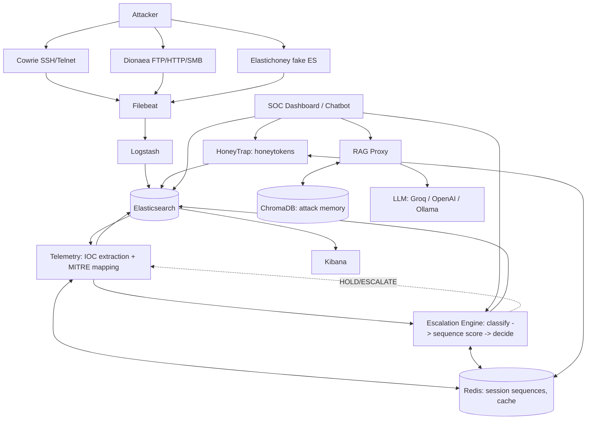

# Architecture

## Data Flow

## Network Isolation

Two Docker networks enforce a hard boundary between attacker-facing and
internal infrastructure:

- **`edge_net`** — Cowrie, Dionaea, Elastichoney only. These containers have
  no route to Elasticsearch, Redis, ChromaDB, or any AI service. They write
  logs to **shared volumes**, not over the network.
- **`core_net`** — everything else (Filebeat, Logstash, Elasticsearch,
  Kibana, Telemetry, Escalation Engine, RAG Proxy, HoneyTrap, SOC Chatbot,
  Redis, ChromaDB). Filebeat tails the honeypot log volumes from here and
  forwards into the pipeline, so the honeypots never need core network
  access at all.

This means a fully compromised honeypot container still cannot reach the
analysis/AI layer over the network — the only path from edge to core is the
one-way log volume Filebeat reads from.

## Component Notes

### Sensor Layer
- **Cowrie** — SSH (2222) + Telnet (2223). JSON event log
  (`var/log/cowrie/cowrie.json`) captures login attempts, full command
  sessions, and downloaded files.
- **Dionaea** — FTP (21→2121), HTTP (80→8080), SMB (445→4445). The
  `log_json` ihandler captures connections, protocol offers, downloads, and
  exploit attempts as JSON.
- **Elastichoney** — a small custom FastAPI service (the original
  jordan-wright/elastichoney project is unmaintained and pre-dates modern
  Elasticsearch APIs). It mimics an old, vulnerable-looking ES node
  (`version 1.4.2` in its banner) and logs every request, flagging
  `"script"`-field payloads as RCE attempts (the historical Groovy/MVEL
  scripting-engine exploits).

### Telemetry Layer (`telemetry/`)
Polls `honeypot-*` indices in Elasticsearch on a fixed interval,
runs `ioc_extractor.py` (regex-based IP/domain/URL/hash extraction with a
heuristic risk score) and `mitre_mapper.py` (keyword → ATT&CK technique
table) over each event, indexes IOC docs into `iocs-*`, maintains a
per-session rolling command window in Redis, and forwards each command to
the Escalation Engine.

### Escalation Engine (`escalation_engine/`)
Three swappable stages (see file docstrings for the upgrade path to fully
trained models):
1. **Classifier** — rule-based keyword classifier by default; if
   `USE_PRETRAINED_NLP=true`, a pretrained DistilBERT sentiment pipeline
   blends in as an auxiliary signal (no labeled "malicious command" dataset
   exists publicly, so this is the documented trade-off for the demo).
2. **Sequence analyzer** — heuristic stand-in for the spec's LSTM: scores
   session length, MITRE-tactic diversity, and malicious-keyword density.
3. **Decision policy** — threshold-based stand-in for the spec's DQN:
   blends classifier + sequence scores into a 0–100 risk score and a
   HOLD/ESCALATE decision.

### RAG Proxy (`rag_proxy/`)
Stores/retrieves attack memory in ChromaDB (`chroma_client.py`) and forwards
RAG-augmented prompts to a swappable LLM backend (`llm_backends.py`) —
Groq by default, OpenAI/Ollama available via `LLM_PROVIDER`.

### HoneyTrap (`honeytrap/`)
Generates fake AWS keys, API tokens, SSH keypairs, DB dumps, and generic
credentials (`generators.py`), stores them in Redis with scheduled
rotation, and raises an alert the moment any caller reports a token being
accessed.

### Dashboard (`dashboard/chatbot.py`)
Streamlit app: Overview (ES aggregations), SOC Chatbot (RAG proxy), and a
Honeytoken Alerts feed.
